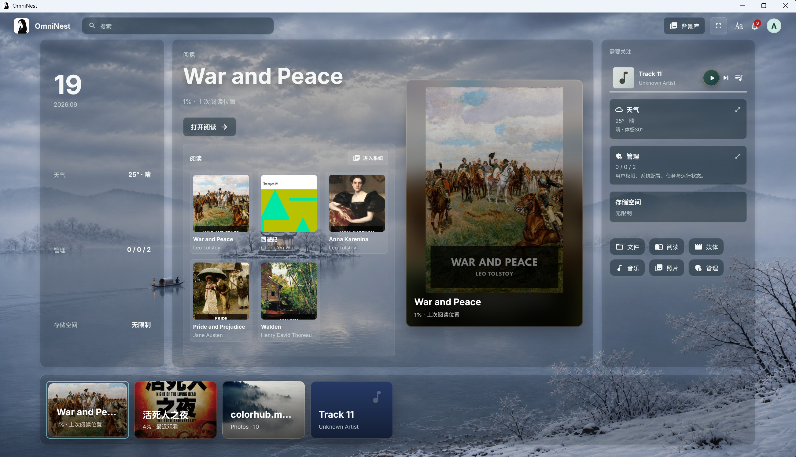
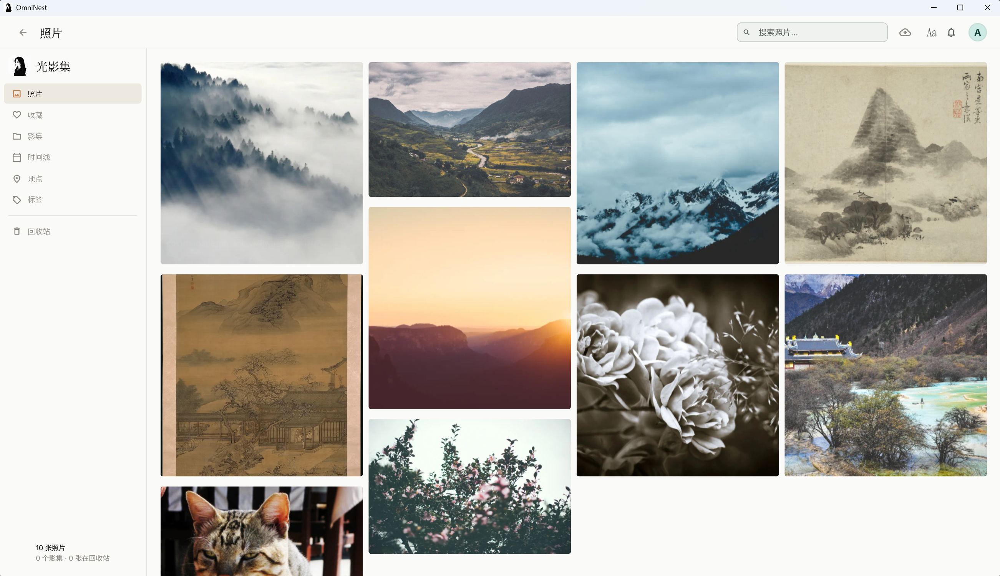
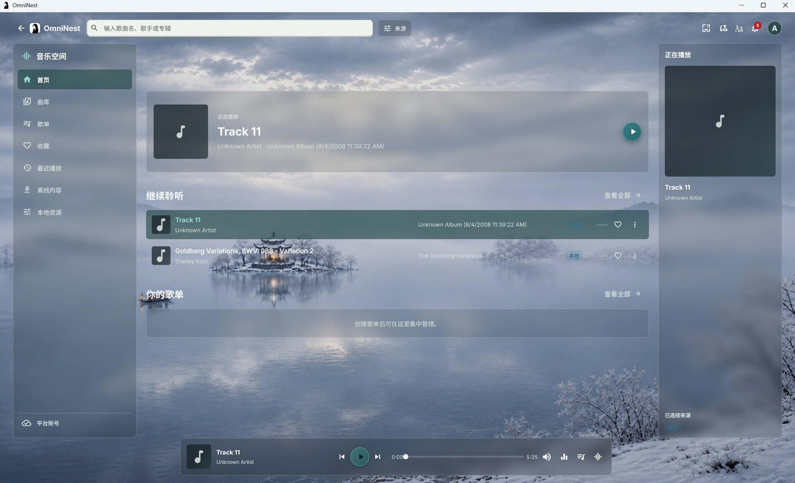
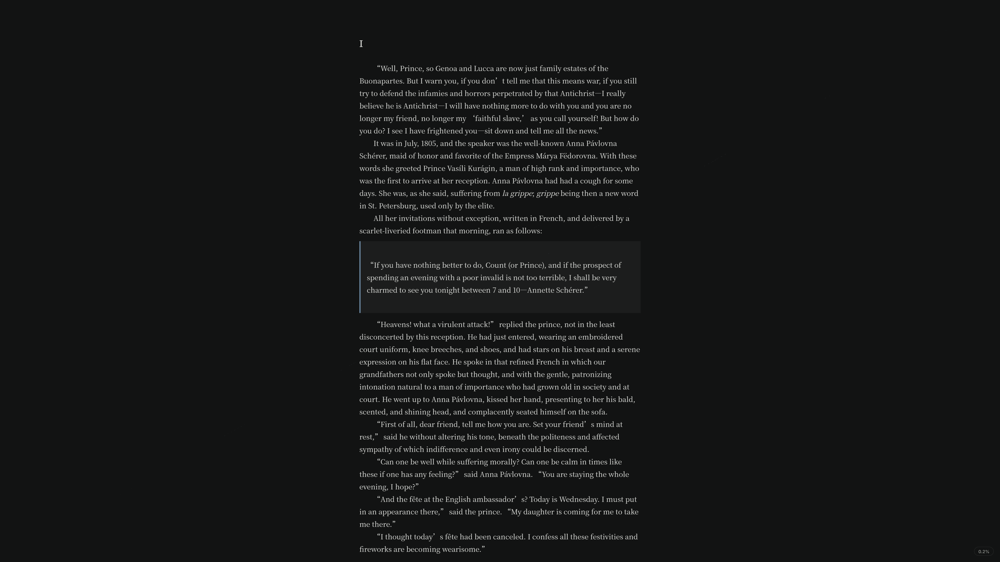
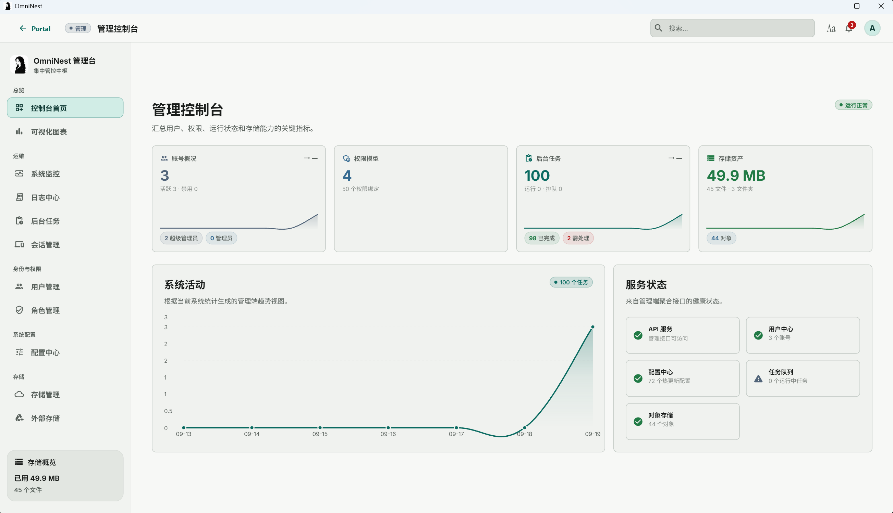
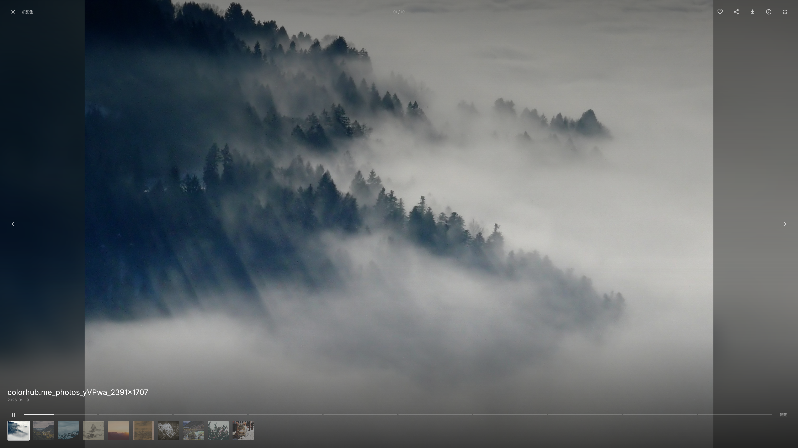
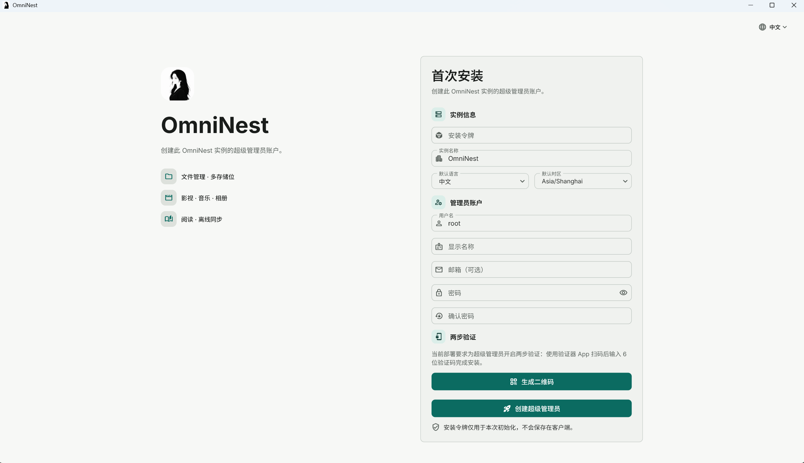

<p align="center">
  
</p>

<p align="center">
  <strong>OmniNest</strong>
</p>

<h3 align="center">自托管媒体中心</h3>

<p align="center">
  文件 · 影视 · 音乐 · 相册 · 阅读 —— 统一账户、权限、存储与后台任务
</p>

---

OmniNest 是一个面向个人与家庭场景的**自托管**媒体中心。它把文件管理、影视、音乐、相册和阅读组织在同一套账户、权限、对象存储与异步任务体系中，由你自己部署、自己持有数据。

本仓库为**模块化单体**：Spring Boot 提供 API / Worker / Scheduler，Flutter 提供客户端。后端与 API 见 [backend/README.md](backend/README.md)，客户端见 [frontend/README.md](frontend/README.md)，部署见 [deploy/README.md](deploy/README.md)。

> **状态**：项目持续开发中。下文说明产品能力、平台支持、免责声明与最短启动路径。

---

## 免责声明（Disclaimer）

请在使用 OmniNest 前仔细阅读本节。**使用本软件即表示你已理解并接受下列条款。**

### 内容与版权

- OmniNest **不提供、不分发、不附带**任何影视、音乐、电子书、图片等媒体内容。
- 你**仅可**通过本系统存储、管理、播放你**合法拥有**或**依法有权使用**的媒体与文件。
- 上传、导入或共享受版权保护的内容前，你必须自行确保具备相应权利。因内容来源、传播方式或使用方式引发的任何版权或法律纠纷，**由使用者自行承担全部责任**，与本项目开发者、贡献者无关。
- 本项目**不鼓励、不支持**任何形式的盗版、侵权或非法内容传播。
- 文档中的界面示意图与演示素材**均为公有领域 / CC0** 等无版权风险资源。**请勿将受版权保护的内容写入本仓库或用于公开演示。**

### 软件本身

- 本软件按 **「现状」（AS IS）** 提供，**不附带任何明示或默示的担保**，包括但不限于适销性、特定用途适用性与不侵权。
- 在适用法律允许的最大范围内，作者与贡献者**不对**因使用或无法使用本软件而导致的任何直接、间接、附带或后果性损失负责，包括数据丢失、服务中断、设备损坏或业务损失。
- 自托管环境的安全、备份、密钥管理、公网暴露面与访问控制，**由部署者自行负责**。默认配置面向个人/内网场景，**不等于**可直接用于未加固的公网生产。

### 平台支持

- 当前**官方推荐并验证**的客户端为 **Web、Android、Windows**。
- Flutter 工程内含 iOS / macOS 相关目录与适配代码，但**未完成与上述三端同级的全量测试**，**不推荐**在生产或重要场景使用；如需使用，请自行充分验证。
- 是否启用病毒扫描（ClamAV）、图像分析等可选组件，由部署方按机器资源与暴露面自行决定；个人 4C4G 场景通常可关闭扫描，公网生产建议评估后开启。

### 第三方音乐平台

OmniNest 内置的开源音乐播放模块并非网易云音乐或其关联公司的官方客户端，与其不存在隶属、合作或授权关系；"网易云音乐"等名称与商标仅作标识说明用途，权利归各自权利人所有。

平台接入能力仅供个人学习、研究与本地客户端体验，基于使用者自行登录的自有账号辅助播放，不得用于商业或非法用途。项目不存储、不分发平台音乐内容，也不提供绕过付费或会员限制、破解音质的能力。使用者应自行遵守对应平台的用户协议、版权规则与会员权益条款；平台内容版权归相应平台及权利人所有，因使用方式不当产生的风险与责任由使用者自行承担。

### 隐私与数据

- 数据默认保存在**你自己的**服务器与存储中。开发者**不会**通过本软件收集你的媒体库内容。
- 你需自行遵守所在地关于个人信息、网络服务与数据存储的法律法规；因部署者配置、权限开放或公网暴露导致的隐私与数据风险，由部署者自行承担。

> 完整的隐私说明见 [`PRIVACY.md`](./PRIVACY.md)；第三方组件的许可与署名归集见 [`NOTICE.md`](./NOTICE.md)。

---

## 界面预览

<table>
  <tr>
    <th>门户工作台</th>
    <th>照片</th>
  </tr>
  <tr>
    <td></td>
    <td></td>
  </tr>
  <tr>
    <th>影视详情</th>
    <th>音乐</th>
  </tr>
  <tr>
    <td></td>
    <td></td>
  </tr>
  <tr>
    <th>阅读器</th>
    <th>管理控制台</th>
  </tr>
  <tr>
    <td></td>
    <td></td>
  </tr>
  <tr>
    <th>照片幻灯片</th>
    <th>安装向导</th>
  </tr>
  <tr>
    <td></td>
    <td></td>
  </tr>
</table>

截图目录：

| 平台 | 目录 | 说明 |
| --- | --- | --- |
| 桌面端 / Web | [imgs/desktop](imgs/desktop) | 覆盖门户、照片、影视、音乐、阅读、管理与安装向导等 22 张 |
| Android | `imgs/mobile` | 建设中，截图将陆续补充 |

---

## 核心能力

| 模块 | 说明 |
| --- | --- |
| **Portal** | 统一工作台、动态背景、最近内容、通知与模块入口 |
| **File Manager** | 上传、目录、搜索、预览、下载、回收站与存储生命周期 |
| **Photos** | 相册与时间线、缩略图、元数据、位置与可选图像分析（当前侧车以人脸检测/嵌入/聚类为主） |
| **Movies** | 影视库、海报与详情、播放、字幕、进度与本地只读媒体源 |
| **Music** | 本地曲库、外部平台、队列、封面/歌词与播放进度 |
| **Reader** | EPUB 等导入、目录、文本/漫画阅读、书签、批注与进度 |
| **Admin** | 用户与角色权限、配置、任务、日志、审计与运行状态 |
| **Profile** | 主题、偏好与账号安全 |

---

## 平台支持

| 平台 | 支持级别 | 说明 |
| --- | --- | --- |
| **Web** | ✅ 推荐 / 已验证 | 现代桌面浏览器（开发基线：Chrome） |
| **Android** | ✅ 推荐 / 已验证 | 紧凑导航与触控布局 |
| **Windows** | ✅ 推荐 / 已验证 | 桌面窗口、键鼠操作 |
| **iOS / macOS** | ⚠️ 不推荐 | 有 Flutter 工程适配，**未全量测试**，请自行验证后再用 |

### 客户端获取与服务器配置

- **Web**：随部署栈由 Nginx 托管，浏览器打开即用（同源连接后端）。
- **Android / Windows**：安装包不内置服务器地址，**首次启动在引导页输入自托管服务器地址**（支持 `host`、`host:端口` 或完整地址），校验通过后进入登录或安装向导；已登录后可在“个人资料 → 服务器与连接”中更换。
- 定制构建：`frontend/scripts/build_signed_*_release.ps1` 可选传 `-ApiBaseUrl` 预置服务器地址（家庭分发场景，升级换址随包传播），`-RequireHttps` 构建仅允许 HTTPS 地址的严格包。服务端不提供独立 jar，以 Docker 镜像发布（见 deploy/README.md）。

---

## 技术栈

| 层次 | 说明 |
| --- | --- |
| 客户端 | Flutter / Dart（Web · Android · Windows） |
| 后端 | Java 21 · Spring Boot，模块化单体（API / Worker / Scheduler） |
| 数据与存储 | PostgreSQL · MinIO · RabbitMQ · Redis · Lucene · 可选图像分析侧车 |

---

## 仓库结构

| 目录 | 说明 |
| --- | --- |
| [backend](backend/README.md) | 后端服务、模块与测试（日志：`backend/logs/`） |
| [frontend](frontend/README.md) | Flutter 客户端与测试（日志：`frontend/logs/`） |
| [deploy](deploy/README.md) | 开发/生产 Docker 编排与部署说明 |
| [deploy/ai-sidecar](deploy/ai-sidecar/README.md) | 图像分析侧车 |
| [imgs](imgs) | 文档用截图资源 |

---

## 环境要求

- Git；Docker Desktop 与 Docker Compose（基础设施）
- JDK 21 与 Maven（后端）
- Flutter stable（验证基线：Flutter 3.44.8 / Dart 3.12.2）
- Chrome（Web）；Android Studio / SDK（Android）；Windows 工具链（桌面端）

---

## 资源建议（个人自托管）

| 场景 | 建议 | 病毒扫描（ClamAV） |
| --- | --- | --- |
| 个人 / 内网 | **4 核 4GB** | 默认可关闭 |
| 公网生产 | **4 核 8GB+** | 建议评估后开启 |

生产 Compose 默认面向 **4C4G、不启动 ClamAV / 图像分析** 的个人自托管画像；是否开启扫描由部署者决定。详见 [deploy/README.md](deploy/README.md)。

---

## 快速开始

以下命令在项目根目录执行；后端与前端建议使用两个终端。

### 1. 获取代码

```bash
git clone git@github.com:AtaraxyEcho/omni-nest.git
cd omni-nest
```

### 2. 启动开发依赖

```bash
cp deploy/dev/.env.example deploy/dev/.env
docker compose --env-file deploy/dev/.env -f deploy/dev/docker-compose.yml up -d
```

若本机为 `docker-compose`（旧插件）而非 `docker compose`，请改用对应命令。

各 `.env.example` 模板在同目录提供英文版 `.env.en.example`（变量一致，仅注释语言不同）。

### 3. 启动后端

```bash
cp backend/.env.example backend/.env
cd backend
mvn -pl omninest-app spring-boot:run -Dspring-boot.run.profiles=dev
```

默认 API：`http://localhost:8080/api/v1`（或以 `backend/.env` 中端口为准，例如 `9090`）。

### 4. 启动 Flutter Web

```bash
cd frontend
test -f env/dev.json || cp env/dev.example.json env/dev.json
flutter pub get
flutter run -d chrome --web-port=3000 --dart-define-from-file=env/dev.json
```

浏览器打开 `http://localhost:3000`；首次安装访问 `http://localhost:3000/setup`。

`env/dev.json` 必须通过 `--dart-define-from-file` 或 `--dart-define` 传入。Android / Windows 将 API、WebSocket 改为设备可访问的后端地址后，同样使用该配置启动。

### 5. Android / Windows

```bash
flutter run -d <android-device-id> --dart-define-from-file=env/dev.json
flutter run -d windows --dart-define-from-file=env/dev.json
```

### 6. 生产部署

参见 [deploy/README.md](deploy/README.md)。

**媒体素材**：本仓库文档中的界面示意图与演示素材**均为 CC0 / 公有领域**资源（见免责声明）。请勿使用受版权保护的内容。

---

## 测试与质量

| 范围 | 命令 |
| --- | --- |
| 后端 | `cd backend && mvn test` |
| 前端 | `cd frontend && flutter test` |
| 前端静态检查 | `cd frontend && flutter analyze lib` |

自动化覆盖业务查询与关键页面行为；**Docker 不可用时**，部分 Testcontainers / 迁移用例会 Skipped。**三端端到端 UI、Android 原生层、iOS/macOS** 未纳入当前全量自动化验收。

---

## 相关文档

- [后端](backend/README.md)
- [前端](frontend/README.md)
- [部署](deploy/README.md)
- 产品说明亦可参考 [PRODUCT.md](PRODUCT.md)（若存在）

---

## 许可证

本项目以仓库根目录 [LICENSE](LICENSE) 为准。使用、修改与分发前请阅读该文件全文。

---

<p align="center">
  <sub>
    OmniNest 为自托管软件。请合法使用媒体内容，并对自身部署与数据安全负责。
  </sub>
</p>
